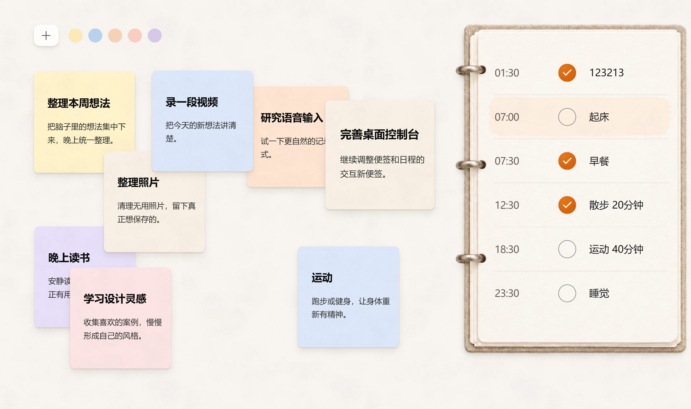

# 灵序 Lingxu

> 把散落的灵感，变成看得见的优先级和可以执行的日程。

灵序是一个 Windows 本地优先的个人行动桌面。它不是传统的列表式 Todo：左侧是一块可以自由摆放、叠放和着色的灵感画布，右侧是一册负责落实行动的日程本。颜色、位置和层级保留人的直觉与自由，时间安排和完成记录负责把想法带回现实。



## 为什么做灵序

人的想法通常不是按表格出现的。

灵序允许你先把念头随手放下来，不必立刻决定它属于哪个项目；等想法积累起来，再通过颜色、空间位置和叠放层级表达轻重缓急，最后把真正要做的事情安排进当天日程。

它希望同时保留两样东西：

- 发散的自由——灵感不会因为来不及归类而溜走。
- 行动的秩序——时间有限，想法需要被比较、取舍和落实。

## 核心体验

- **灵感池**：每张便签拥有标题、摘要和独立 Markdown 正文。
- **自由画布**：便签可以拖拽、缩放、换色、重叠、上移层级或置顶到其他应用之上。
- **视觉优先级**：位置、颜色与叠放关系都是信息，而不只是装饰。
- **展开写作**：双击便签原地展开为可移动的大纸页，支持标题层级、加粗、斜体、高亮和图片。
- **日程与打卡**：固定生活支柱与临时安排使用统一外观，点击任务行即可完成或撤销。
- **每日记录**：任务状态写入每日 Markdown，控制层状态保存在 JSON。
- **桌面级存在**：应用驻留在启动时所在的 Windows 虚拟桌面，不占任务栏；其他虚拟桌面仍是正常文件桌面。
- **本地与便携**：业务数据跟随程序目录，可以将整个目录复制带走。

## 产品阶段

当前里程碑是 **v0.9-core**：视觉、桌面交互、便签、日程和本地记录已经完成。

下一阶段只聚焦一件事：引入 AI，从第三视角对灵感进行聚类、整理和优先级分析，并在用户确认后同步回颜色、位置、层级和日程。

## 数据设计

运行后，业务数据保存在程序旁边的 `数据/` 目录：

```text
数据/
  灵感池/
    index.json              # 颜色、位置、大小、层级和文档索引
    <便签标题>.md           # 每张便签独立一份 Markdown
    便签图片/               # 正文中的本地图片
    已完成/                 # 完成归档
    回收站/                 # 删除后的可恢复文件
  日程/
    state.json              # 当前任务、循环规则与完成状态
    每日记录/<年份>/        # 面向用户的每日 Markdown
  WebView2/                 # 可重新生成的渲染缓存
```

仓库通过 `.gitignore` 排除整个 `数据/` 目录，不会上传使用者的私人便签与日程。

## 技术结构

- **WPF / C#**：Windows 桌面宿主、虚拟桌面行为、置顶便签和本地控制层。
- **WebView2**：连接原生宿主与 Web 前端。
- **HTML / CSS / JavaScript**：便签画布、纸张材质、活页日程和展开编辑器。
- **JSON**：应用运行状态和控制层数据。
- **Markdown**：便签正文与面向用户的长期记录。

主要入口：

- `WebWorkspace.cs`：产品入口与 WebView 消息桥。
- `DesktopAppHost.cs`：可复用的 Windows 桌面宿主。
- `NotesStore.cs`：一便签一文档及布局索引。
- `TaskController.cs`：日程、循环规则与完成状态。
- `web/`：当前实际渲染的完整前端。

## 构建

环境要求：

- Windows 10/11
- .NET Framework 4.x
- Microsoft Edge WebView2 Runtime

```powershell
powershell -ExecutionPolicy Bypass -File .\build.ps1
```

构建脚本会在首次运行时自动恢复 WebView2 SDK。生成完成后运行：

```powershell
.\DesktopGrowth.exe
```

调试预览模式：

```powershell
.\DesktopGrowth.exe --preview
```

## 桌面行为

正式窗口由 Explorer 桌面窗口持有，保持在桌面图标之上、普通应用之下。点击 Windows“显示桌面”时会直接看到灵序，而不是先露出原壁纸再闪回应用。

程序会记住启动时所在的虚拟桌面：

- 在该桌面显示灵序。
- 切换到其他虚拟桌面时自动隐藏。
- 切回来后自动恢复。

这样可以把一个桌面留给灵感与计划，把另一个桌面留给文件、快捷方式和普通工作。

## 版本

当前基线：[v0.9-core 版本说明](版本说明-v0.9-core.md)

项目仍处在个人产品验证阶段。AI 整理能力尚未接入，语音入口、冲突检测和提醒也不属于当前基线。

